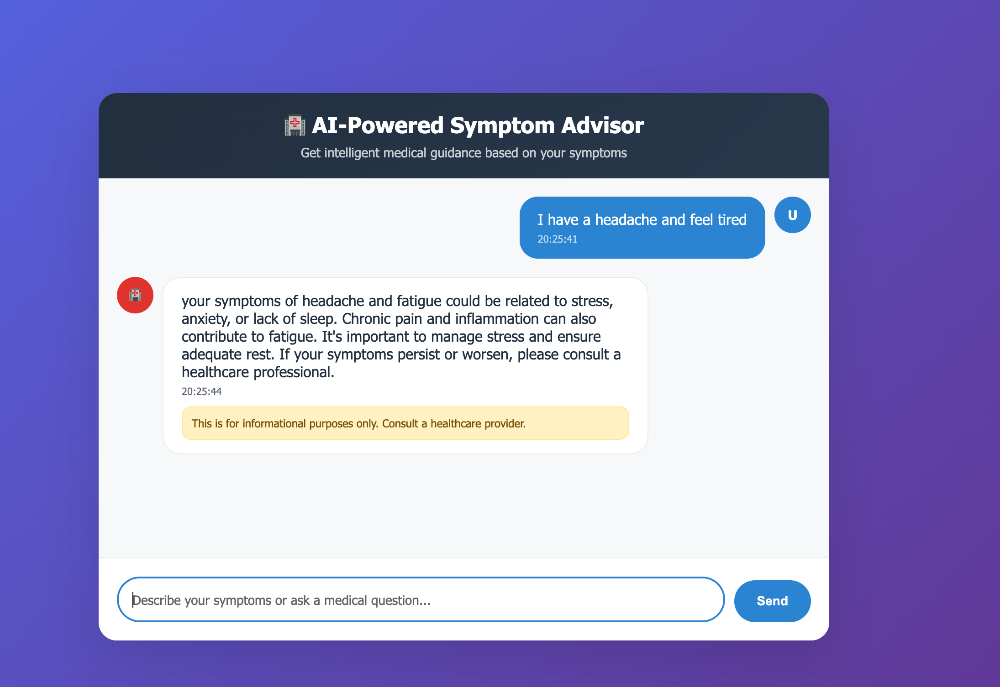

# AI-Powered Symptom Advisor

A simple LLM-based web application that provides intelligent medical guidance based on user symptoms using AI and medical knowledge base.



## Problem Statement

People often need quick medical guidance for their symptoms but may not have immediate access to healthcare professionals. This application provides preliminary medical advice based on a comprehensive medical knowledge base, helping users understand their symptoms better.

## Features

- **Symptom Analysis**: AI-powered analysis of user-described symptoms
- **Emergency Detection**: Automatic detection of critical symptoms requiring immediate attention
- **Medical Knowledge Base**: Trained on comprehensive medical literature
- **Simple Chat Interface**: Easy-to-use conversational interface
- **Medical Disclaimers**: Clear warnings about the informational nature of advice

## Technologies Used

- **Backend**: Flask (Python)
- **AI/ML**: LangChain, OpenAI GPT, HuggingFace Transformers
- **Vector Database**: FAISS for document similarity search
- **Document Processing**: PyPDF for medical literature processing
- **Frontend**: HTML, CSS, JavaScript
- **Environment**: Python virtual environment with pip

## Project Structure

```
AI_Powered_Symptom_Advisor/
├── README.md
├── requirements.txt
├── .env
├── src/
│   ├── application.py          # Main Flask application
│   ├── static/
│   │   └── index.html         # Web interface
│   ├── components/
│   │   ├── retriever.py       # QA chain and retrieval logic
│   │   ├── llm.py            # Language model configuration
│   │   ├── vector_store.py   # Vector database operations
│   │   ├── embedding.py      # Text embedding functions
│   │   └── pdf_loader.py     # PDF document processing
│   ├── common/
│   │   ├── logger.py         # Logging configuration
│   │   └── custom_exception.py # Custom error handling
│   └── config/
│       └── config.py         # Environment configuration
├── data/
│   └── medical_documents.pdf  # Medical knowledge base
├── vectorstore/
│   └── db_faiss/             # FAISS vector database
└── logs/                     # Application logs
```

## Quick Start

1. **Clone the repository**
```bash
git clone https://github.com/beniamine3155/AI_Powered_Symptom_Advisor.git
cd AI_Powered_Symptom_Advisor
```

2. **Set up environment**
```bash
python -m venv .venv
source .venv/bin/activate  # On Windows: .venv\Scripts\activate
pip install -r requirements.txt
```

3. **Configure API keys**
Edit `.env` file with your API keys:
```
OPENAI_API_KEY=your_openai_api_key
GROQ_API_KEY=your_groq_api_key
```

4. **Run the application**
```bash
cd src
python application.py
```

5. **Access the application**
Open your browser and go to: `http://localhost:8001`

## Important Notice

**Medical Disclaimer**: This application is for informational purposes only and should not replace professional medical consultation. Always consult a qualified healthcare provider for proper diagnosis and treatment.
